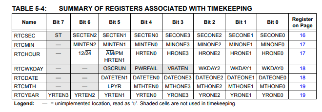

# Portable Bitfields C++ library

This is a C++17 cross-platform bitfields header-only library, with defined behaviour, in the contrary to the standard. 
This library intends to strictly define the behaviour, which the standard leaves for the compilers to 
define. Implements serialization and deserialization of the bitfields, and this is the main objective of this library.

Examples of usage:

* Accessing single bits of registers in ICs, from which the data is obtained through I2C, SPI, UART, ...
* Protocol headers.
* ...

## Note - Contributing Upstream

Formatting and several additional CMake files have been added since forking this repository.  When making changes that may be contributed upstream, these changes should not be included in the pull request.  

The v1.0.0 tag was created on the origional commit from the fork.  The recommended development process is as follows:
 
 - Check out v1.0.0
 - Create a new branch
 - Pull any upstream changes from the upstream repo (if they exist)
 - Do development work
 - Submit a PR request to upstream repo
 - Pull .clang-format from main into branch
 - Ensure that all formatting is correct to the .clang-format specification
 - Merge into main


## Contents

- [Features](#features)
- [Why use this library?](#why-use-this-library)
- [Usage](#usage)
  * [Basic usage](#basic-usage)
  * [Example use case #1: RTP header's first word](#example-use-case-%231-rtp-headers-first-word)
  * [Example use case #2: Zigbee ZCL header field Frame Format](#example-use-case-%232-zigbee-zcl-header-field-frame-format)
  * [Example use case #3: IC MP2695 Status register](#example-use-case-%233-ic-mp2695-status-register)
- [Installation](#installation)
- [Interface](#interface)
  * [at()](#at)
  * [serialize()](#serialize)
  * [extract()](#extract)
- [Constraints, expected behaviour, tips and other notes](#constraints-expected-behaviour-tips-and-other-notes)
  * [1. Overflow, or out-of-range](#1-overflow-or-out-of-range)
  * [2. Field ID type](#2-field-id-type)
  * [3. Field ID](#3-field-id)
  * [4. Field sizes](#4-field-sizes)
  * [5. Padding](#5-padding)
  * [6. Mask](#6-mask)
- [Building and testing](#building-and-testing)
- [To research](#to-research)
- [Todos](#todos)

## Features

* Overflow and out-of-range defined bevaviour: least significant bits of the value are masked to fit into the bitfield.
* Bitfields are packed left-to-right, in the same order they are defined.
* Bitfields are packed, thus straddling is supported.
* Configurable padding, by enforcing whole underlying type allocation.
* Implements bitfield serialization, deserialization and extraction of a single bitfield's value, with proper shifting.
* Compile-time checking of the bitfield name.
* No dynamic allocation (aka, no use of new/malloc).
* No macros.
* No exceptions.
* C++17.
* Tested with GCC 11.1 and Clang 13.0.0.
* Supports bitfield groups total length up to 8 bytes.

## Why use this library?

Consider, as an example, the [MCP7940](http://ww1.microchip.com/downloads/en/devicedoc/20005010f.pdf) 
RTC clock IC, I2C controlled.
To read the current time, one needs to decode it from the registers below:



Most of those registers contain BCD encoded value, plus some extra configuration bitfields. Let's try to decode the
seconds the common way.

So, firstly we define the positions and masks for the fields:

```
#define RTCSEC_SECTEN_MASK 0b01110000
#define RTCSEC_SECTEN_POS 4

#define RTCSEC_SECONE_MASK 0b00001111
#define RTCSEC_SECONE_POS 0
```

Then we have to properly retrieve the data, from the register read over the wire:

```
uint8_t rtcsec{read(RTCSEC_ADDRESS)};
unsigned second_tens{(rtc_sec & RTCSEC_SECTEN_MASK) >> RTCSEC_SECTEN_POS};
unsigned second_ones{(rtc_sec & RTCSEC_SECONE_MASK) >> RTCSEC_SECONE_POS};
unsigned seconds{second_tens * 10 + second_ones};
```

There is ambiguity, because we have to remember that the mask here is shifted, so it masks the field value in-place.
After masking, we have to shift the value to retrieve it. Another approach is to apply the mask after shifting, so
it means that one have to remember which approach is used, when retrieving the bitfield values.

Now, in each register, for each bitfield, we have to define a mask and the position of the bitfield. That explodes
number of the defines. For MCP7940 it will be around 20 pairs of such defines, to handle the timekeeping registers. 
Then we have to implement the actual code which retrieves the value for each such register. That is error-prone and
vulnerable to human-error.

The example above is quite easy, but imagine implementing e.g. a BLE stack, and defining all the header formats
by hand, the way explained above; or a more complex device with 4-byte registers, having multiple various fields. Auch!

This library takes headache away from you. Taking the `RTCSEC` register:

```
enum class RtcsecFields
{
    st, secten, secone
};

using namespace jungles;
using Rtcsec = Bitfield<uint8_t, // The underlying type
                        Field<RtcSecFields::st, 1>, // Field ID (or name) and its size
                        Field<RtcSecFields::secten, 3>, 
                        Field<RtcSecFields::secone, 4>>;

// ...
Rtcsec rtcsec{read(RTCSEC_ADDRESS)};
unsigned second_tens{rtcsec.at<RtcSecFields::secten>()};
unsigned second_ones{rtcsec.at<RtcSecFields::secone>()};
unsigned seconds{second_tens * 10 + second_ones};
```

As you can see, all the masking and shifting is done for you. Just define the layout and you are good to go!

## Usage

### Basic usage

Define field IDs (names):

```
enum class Id
{
    f1, f2, f3
};
```

Define bitfield type:

```
using namespace jungles;

using UnderlyingType = uint16_t;
using Register = Bitfields<
    UnderlyingType, 
    Field<Id::f1, 3>, // <Id, Bit-size>
    Field<Id::f2, 9>, 
    Field<Id::f3, 4>>; 

```

The `UnderlyingType` will be occupied by the single fields like that:

```
f1 = X
f2 = Y
f3 = Z

XXXYYYYYYYYYZZZZ - 16 bits in total, because uint16_t has bit-size equal to 16
```

The above code shall emulate a structure like this:

```
struct RegisterWithRawBitfields
{
    uint16_t f1 : 3;
    uint16_t f2 : 9;
    uint16_t f3 : 4;
};
```

Use the bitfields:

```
Register r; // Default zero-initialized.
r.at<Id::f1>() = 0b101;
r.at<Id::f2>() = 0b001111100;
r.at<Id::f3>() = 0b0110;

// Emulates that:
// RegisterWithRawBitfields r_raw;
// r_raw.f1 = 0b101; 
// r_raw.f2 = 0b001111100; 
// r_raw.f3 = 0b0110; 

ASSERT(r.extract<Id::f1>() == 0b1010000000000000);
ASSERT(r.extract<Id::f2>() == 0b0000011111000000);
ASSERT(r.extract<Id::f3>() == 0b0000000000000110);

ASSERT(r.serialize() == 0b1010011111000110);

```

Deserialize:

```
Register r{0b0101110001110110};
//           XXXYYYYYYYYYZZZZ
ASSERT(r.at<Id::f1>() == 0b010);
ASSERT(r.at<Id::f2>() == 0b111000111);
ASSERT(r.at<Id::f3>() == 0b0110);
```

### Example use case #1: RTP header's first word

```
enum class RtpHeaderField
{
    version, padding, extension, csrc_count, marker, payload_type, sequence_number
};

using namespace jungles;
using RtpHeaderFirstWord = Bitfields<
    uint32_t,
    Field<RtpHeaderField::version,              2>,
    Field<RtpHeaderField::padding,              1>,
    Field<RtpHeaderField::extension,            1>,
    Field<RtpHeaderField::csrc_count,           4>,
    Field<RtpHeaderField::marker,               1>,
    Field<RtpHeaderField::payload_type,         7>,
    Field<RtpHeaderField::sequence_number,      16>>;

// ...
std::vector<uint32_t> rtp_header{get_from_external_world_over_network()};

// Will automatically assign field values (deserialize).
RtpHeaderFirstWord rtp_header_first_word{rtp_header[0]};
```

### Example use case #2: Zigbee ZCL header field Frame Format

```
enum class FrameFormatFields
{
    frame_type, manufacturer_specific, direction, disable_default_response, reserved
};

using namespace jungles;
using ZclFrameFormat = Bitfields,
    uint32_t,
    Field<FrameFormatFields::frame_type,               2>,
    Field<FrameFormatFields::manufacturer_specific,    1>,
    Field<FrameFormatFields::direction,                1>,
    Field<FrameFormatFields::disable_default_response, 1>,
    Field<FrameFormatFields::reserved,                 2>>;
```

### Example use case #3: IC MP2695 Status register

```
enum class StatusField
{
    reserved1 = 0,
    chg_stat,
    vppm_stat,
    ippm_stat,
    usb1_plug_in,
    reserved2
};

using namespace jungles;
using Status = Bitfields<uint8_t, 
                         Field<StatusField::reserved1,    2>, 
                         Field<StatusField::chg_stat,     2>,
                         Field<StatusField::vppm_stat,    1>,
                         Field<StatusField::ippm_stat,    1>,
                         Field<StatusField::usb1_plug_in, 1>,
                         Field<StatusField::reserved2,    1>>;

```

One can utlize the library in such a way:

```
bool MP2695::is_usb_plugged_in()
{
    // Read the register over the wire
    uint8_t status_register_address{0x05};
    auto raw_value{mp2695_on_i2c_interface.read(status_register_address)}; // Depends on your implementation.

    // Initialize our Status register with the obtained data. It will map to proper bitfields.
    Status status_reg{raw_value}; 
    
    return status_reg.at<status::usb1_plug_in>() == 1;
}
```

## Installation

1. Copy the contents of `src` directory and use the header stright away, by including `jungles/bitfields.hpp` header.
Remember the `-std=c++17` flag!.
2. Use `FetchContent` CMake module:

Note that the GIT_TAG should be updated to the most recent (or most desired) tag.  As of writing, this is v1.0.1

```
include(FetchContent)

FetchContent_Declare(
    JunglesBitfields
    GIT_REPOSITORY https://github.com/PlexusEP/PortableBitfields.git
    GIT_TAG v1.0.1
)

FetchContent_MakeAvailable(JunglesBitfields)

# Use 'jungles::bitfield' library target

```

## Interface

### at()

```
template<auto Id>
UnderlyingType& at();
```

Returns reference to the field under the specified `Id`. One can use any integral-compatible operation on it: 
arithmetic, bitwise, logic, ... operations. Use it to access the specific field: mutate the value, assign new one,
retrieve it as an r-value.

See [operations test](tests/test_operations_on_bitfields.cpp) for usage examples.

### serialize()

```
UnderlyingType serialize() const
```

Returns serialized bitfields, in the left-to-right order (the same as defined with `Bitfields` template).

See [serialization test](tests/test_serializing.cpp) for usage examples.

### extract()

```
template<auto Id>
UnderlyingType extract() const;
```

Returns the bitfield with applied shift, with all of the other bitfields cleared. Is equivalent to operation:

```
field value << field shift
```

See [extraction test](tests/test_extracting.cpp) for usage examples.

## Constraints, expected behaviour, tips and other notes

### 1. Overflow, or out-of-range

When assigning value out of range or overflowing the bitfield value, the least significant bits are masked to fit into
the bitfield, e.g.:

```
using Register = Bitfields<
    uint8_t, 
    Field<Id::f1, 3>,
    Field<Id::f2, 5>>; 

Register r;

r.at<Id::f2>() += 2;
r.at<Id::f2>() += 2;

ASSERT(r.at<Id::f1>() == 0b1);

r.at<Id::f2>() = 0b11111011;
ASSERT(r.at<Id::f2>() == 0b11011);
```

### 2. Field ID type

* Field ID types must be the same for each field. Compilation error occurs otherwise.
* Supported types are integral types, enum classes, enums, or other "structural" type.

### 3. Field ID

* Field IDs must not duplicate; static assertion error goes off otherwise.
* Accessing non-existing field ID is a static assertion error. 

### 4. Field sizes

All the bits within the underlying type must be allocated. If the accumulated bit size is not equal to the underlying
type's bit size, then a static assertion will shoot.

### 5. Padding

To handle padding use "reserved" fields. Since, all of the bits must be allocated, one can control whether underlying
value shall be padded left or right:

```
enum class Id
{
    f1, f2, reserved
};

using namespace jungles;

using RightAlignedRegister = Bitfields<
    uint8_t,
    Field<Id::reserved, 4>,
    Field<Id::f1, 6>,
    Field<Id::f2, 6>>;

using LeftAlignedRegister = Bitfields<
    uint8_t,
    Field<Id::f1, 6>,
    Field<Id::f2, 6>,
    Field<Id::reserved, 4>>;
```

### 6. Mask

To get a field mask, create a bitfield with all bitfields assigned to "ones":

```
using namespace jungles;

using Register = Bitfields<
    uint16_t, 
    Field<Id::f1, 5>, 
    Field<Id::f2, 7>, 
    Field<Id::f3, 4>>; 

Register r{std::numeric_limits<uint16_t>::max()};
ASSERT(r.extract<Id::f2>() == 0b0000011111110000);
```

## Building and testing

Building:

```
cmake -DCMAKE_BUILD_TYPE=Release ..
cmake --build .
```

To enable testing, set `JUNGLES_BITFIELD_ENABLE_TESTING` CMake cache variable.

There is also portability test, which downloads Clang 13.0.0 for Ubuntu 20.04, and runs the complete build and test
with this compiler. To enable it, set `JUNGLES_BITFIELD_ENABLE_PORTABILITY_TESTS`. This takes long to run - few minutes
approximately.

## To research

1. Configurable field ordering, e.g. allow right-to-left field ordering.
2. If Ad.1 legit, then switching ordering at runtime useful?
3. Configurable overflow policies, e.g. allow, throw, clear field, etc.
4. Would it be useful, if the type of a single field could be different than the underlying type of the bitfield group?
5. Would it be useful, if the types of the field IDs wouldn't have to be the same?

## Todos

1. Implement to `std::array` serialization.
2. Allow underlying type `std::array`.
3. Allow `install` target.
4. Turn above todos into issues.
